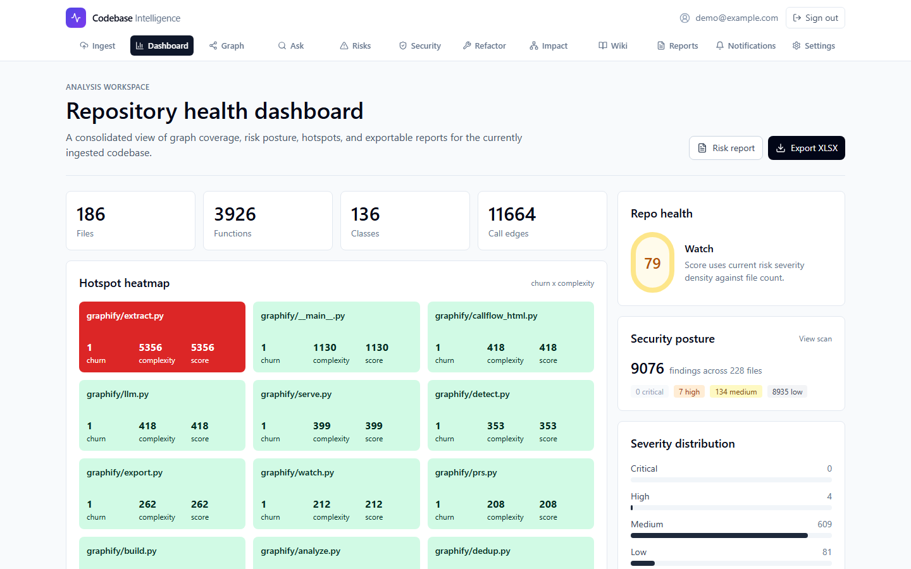
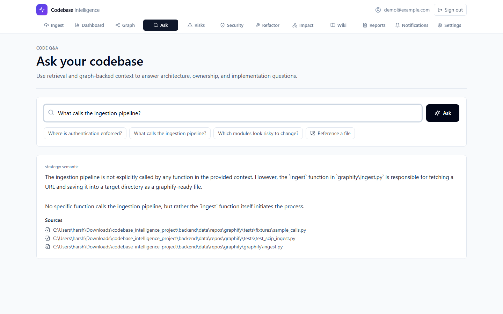
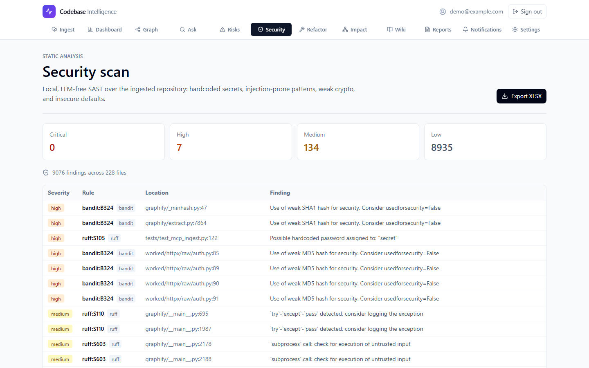
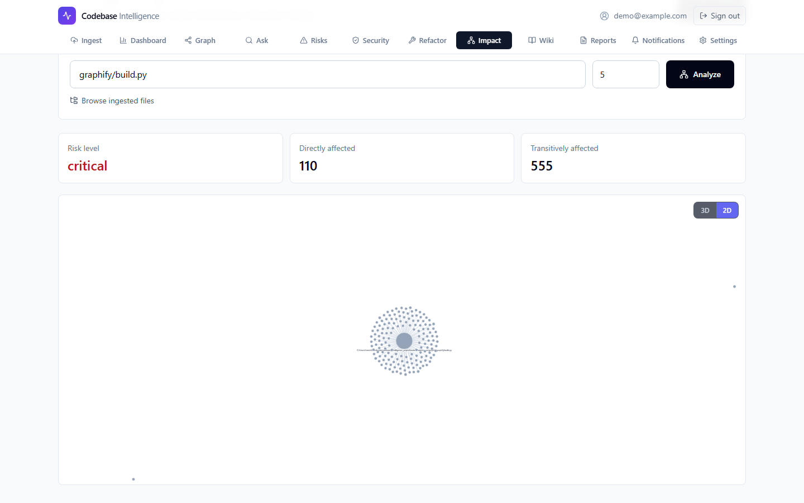

# Enterprise Codebase Intelligence Platform

Open-source platform that ingests any Git repo, builds a knowledge graph + vector index of its code, and answers plain-English questions, detects architecture risks, and computes change-impact / blast radius.

See `PROJECT_PLAN.md` for the architecture, feature matrix, and roadmap
(it supersedes all earlier plan documents). Releases are annotated git tags
with matching entries in [CHANGELOG.md](CHANGELOG.md); contribution
conventions live in [CONTRIBUTING.md](CONTRIBUTING.md).

## Screenshots

| Dashboard | Ask the codebase |
|---|---|
|  |  |

| Security / SAST | Change impact |
|---|---|
|  |  |

More in [docs/screenshots/](docs/screenshots/).

## Quickstart

One installer, one launcher — works straight after `git clone`:

```bash
# Linux / macOS                      # Windows (PowerShell)
./install.sh                         .\install.ps1
./run.sh                             .\run.ps1
```

`install` checks prerequisites (Git, Python 3.11+, Node 20+, Docker optional),
creates `.venv`, installs backend + frontend dependencies, and writes `.env`
from `.env.example`. `run` verifies the environment, picks free ports
automatically, starts ArcadeDB + Chroma in Docker (if available), and launches
the backend and frontend with logs under `logs/`. `Ctrl+C` shuts everything
down cleanly.

**Full production-like stack in Docker** (postgres, redis, minio, arcadedb,
chroma, backend, worker, frontend):

```bash
./run.sh --docker        # Windows: .\run.ps1 -Docker
```

Opens http://localhost:3100. On the very first boot the backend auto-ingests
the bundled **PyShelf demo repo** (`backend/demo_repo/`), so the dashboard,
graph, risks, impact, and security pages have data before you ingest anything —
set `SEED_DEMO_REPO=false` in `.env` to boot empty instead. Edit `.env` to set
a real `AUTH_SECRET` / GitHub OAuth keys / LLM settings before exposing the
stack beyond your machine. Data persists in named Docker volumes;
`docker compose down` stops without touching them, `docker compose down -v`
wipes them.

**Something not working?**

```bash
./run.sh --doctor        # Windows: .\run.ps1 -Doctor
```

diagnoses missing dependencies, unreachable services, and configuration
problems with actionable fixes.

Prefer running individual pieces locally for development? See the per-phase
sections below.

## Status

| Phase | Component | State |
|---|---|---|
| 1 | AST parsing engine | **Done** |
| 2 | Graph database (ArcadeDB) | **Done** |
| 3 | Vector DB + embeddings | **Done** |
| 4 | Risk detection | **Done** |
| 5 | Impact / blast radius | **Done** |
| 6 | Hybrid retrieval + LLM Q&A | **Done** |
| 7 | FastAPI backend | **Done** |
| 8 | Next.js frontend | **Done** |
| 9 | Docker / deployment | **Done** |
| 10 | Security / SAST scanner | **Done** |
| 11 | Refactoring recommendations | **Done** |
| 12 | GitHub OAuth sign-in | **Done** |
| 13 | v1.4 polish: demo seed, changelog + tags, screenshots | **Done** |

### GitHub OAuth (optional)

Create a free OAuth App at github.com/settings/developers (callback URL:
your backend URL + `/auth/github/callback`, e.g.
`http://localhost:8000/auth/github/callback`), then set `GITHUB_CLIENT_ID`
and `GITHUB_CLIENT_SECRET` (e.g. in `.env.local`). The login page shows a
"Continue with GitHub" button automatically when configured; without the
variables, email/password auth keeps working and the button stays hidden.

## Phase 1 — AST Parser

Language-agnostic parser (tree-sitter) extracting `CodeEntity` (functions, classes,
methods) and `CodeRelationship` (contains, calls, inherits_from, imports) objects.
Supports Python, JS/TS, Go, Rust, Java, and more.

### Setup

Use a virtualenv — the pinned versions can otherwise clash with other
globally-installed tools.

```bash
python -m venv .venv
.venv\Scripts\activate        # Windows;  source .venv/bin/activate on Unix
pip install -r backend/requirements.txt
```

### Run on a repo

```bash
python scripts/parse_repo.py /path/to/repo --json out.json
```

### Test

```bash
cd backend && python -m pytest tests/ -q
```

### Validated

Parsed Flask (`src/`, 24 files) in 0.28s — 388 functions/methods, 53 classes,
extracted within ~7% of `grep` ground truth.

## Phase 2 — Graph Database (ArcadeDB)

Ingests parsed `CodeEntity`/`CodeRelationship` objects into an ArcadeDB graph
(`File`/`Function`/`Class`/`Interface`/`Module` vertices; `CONTAINS`/`CALLS`/…
edges). Ingestion uses parameterized `UNWIND $rows` batches — no string-built
Cypher — and typed, index-backed edge matches. Includes SHA-256–based
incremental re-indexing that re-parses only changed files and prunes deleted ones.

### Run ArcadeDB

```bash
docker run -d --name arcadedb -p 2480:2480 -p 2424:2424 \
  -e JAVA_OPTS="-Xmx2g" -e arcadedb.server.rootPassword=ChangeMe123! \
  -v arcadedb_data:/home/arcadedb/databases arcadedb/arcadedb:latest
```

Connection is configured via env vars: `ARCADEDB_URL` (default
`http://localhost:2480`), `ARCADEDB_DATABASE` (`codebase`), `ARCADEDB_USER`
(`root`), `ARCADEDB_PASSWORD`.

### Build the graph from a repo

```bash
python scripts/build_graph.py /path/to/repo            # full ingest
python scripts/build_graph.py /path/to/repo --reset    # drop + rebuild
python scripts/build_graph.py /path/to/repo --incremental  # only changed files
```

### Test

```bash
cd backend && python -m pytest tests/test_graph_db.py -q
```

Unit tests run offline against a recording fake client (no server needed). Set
`ARCADEDB_INTEGRATION=1` with a live ArcadeDB to also run the round-trip test.

## Phase 3 — Vector DB & Embeddings (ChromaDB)

Embeds every parsed entity (AST-aware chunking — one chunk per
function/class/method) with `BAAI/bge-small-en-v1.5` and stores the vectors in
ChromaDB for semantic search ("where are passwords validated?"). The embedder
and Chroma collection are both injectable, and heavy deps (`chromadb`,
`sentence-transformers`/torch) are imported lazily, so the package loads — and
its unit tests run — without them installed.

### Run ChromaDB

```bash
docker run -d --name chroma -p 8000:8000 \
  -v chroma_data:/chroma/chroma ghcr.io/chroma-core/chroma:latest
```

Connection via `CHROMA_HOST` (default `localhost`) and `CHROMA_PORT` (`8000`).

### Embed a repo

```bash
python scripts/embed_repo.py /path/to/repo
python scripts/embed_repo.py /path/to/repo --query "validate user password"
```

First run downloads the ~130MB embedding model to `~/.cache/huggingface`.

### Test

```bash
cd backend && python -m pytest tests/test_vector_db.py -q
```

Offline by default (fake embedder + fake collection). Set `CHROMA_INTEGRATION=1`
with a live Chroma to run the real model + semantic-search round trip.

## Phase 4 — Risk Detection Engine

Runs architecture-smell rules as Cypher queries over the graph and ranks
findings by severity. Each finding is `{type, severity, target, file, details}`;
results can be persisted back as `SecurityIssue` nodes for queryability.

| Rule | Severity | Backed by current data? |
|---|---|---|
| God object (class with too many methods) | high | ✅ |
| Dead code (function with no incoming calls) | medium | ✅ |
| High cyclomatic complexity | medium | ✅ |
| Long method | low | ✅ |
| Shotgun surgery (called from many files) | high | ✅ |
| Deep inheritance | medium | ✅ |
| Circular dependency | high | ⏳ partial — see below |

**`IMPORTS` / `INHERITS_FROM` now populated.** The parser extracts base classes
(`INHERITS_FROM` between in-repo classes) and import statements (`File-[:IMPORTS]->Module`
vertices). This makes the deep-inheritance rule live and powers the inheritance
NL→Cypher example.

**Remaining gaps:** circular-dependency detection needs *module-to-module*
import edges, but imports are currently modeled as `File→Module` (external module
names), which don't form module cycles — so that rule stays empty until imports
are resolved to in-repo modules. The dead-code rule also flags legitimate entry
points (no in-graph caller) — expected until entry-point annotation is added.

### Run

```bash
python scripts/detect_risks.py                  # list risks
python scripts/detect_risks.py --severity high  # filter
python scripts/detect_risks.py --persist        # also write SecurityIssue nodes
```

### Test

```bash
cd backend && python -m pytest tests/test_risk_detection.py -q
```

Offline by default (fake graph client returning canned rows). Set
`ARCADEDB_INTEGRATION=1` with a populated graph to run against live data.

## Phase 5 — Change Impact / Blast Radius

Walks the `CALLS` graph backwards from a file (or single entity) to find every
function transitively affected by a change, buckets them by hop distance
(direct vs transitive, capped at 50), and scores the blast radius
`low → critical` by affected count.

`find_affected_tests` is implemented but needs `COVERED_BY` edges (test-coverage
ingestion, not yet built) — it returns `[]` until then.

### Run

```bash
python scripts/blast_radius.py path/to/file.py --depth 5
```

### Test

```bash
cd backend && python -m pytest tests/test_impact.py -q
```

Offline by default. Set `ARCADEDB_INTEGRATION=1` with a populated graph for the
live smoke test.

## Phase 6 — Hybrid Retrieval + LLM Q&A

Answers plain-English questions by routing each one to the right backend:

- **Structural** questions ("who calls X", "what depends on Y") → an LLM
  translates them to Cypher (few-shot) and runs them on the graph.
- **Semantic** questions ("where are passwords handled") → vector search.
- Structural queries that error or return nothing **fall back** to semantic.

`QueryEngine.answer()` is the single entry point (used by Phase 7): it
retrieves, generates a cited answer, and returns
`{strategy, answer, sources, cypher}`. The LLM is an injectable protocol
(`OllamaClient`, default model `qwen2.5-coder:7b`), so the whole pipeline is
unit-tested offline with fakes.

### Run

```bash
python scripts/ask.py "what functions call validate_user?"
```

Requires a populated graph + vector store + a running Ollama (`ollama pull qwen2.5-coder:7b`).
Config via the shared `LLM_BASE_URL` (default `http://localhost:11434`) and
`LLM_MODEL` (default `qwen2.5-coder:7b`); `OLLAMA_URL` / `OLLAMA_MODEL` are still
accepted as fallbacks. A trailing `/v1` on the base URL is handled either way.

### Test

```bash
cd backend && python -m pytest tests/test_retrieval.py -q
```

Offline by default (fake LLM/graph/vectors). Set `OLLAMA_INTEGRATION=1` with a
running Ollama for the live generation test.

## Phase 7 — FastAPI Backend

REST API wiring every layer together. The app **boots with no backends
running** — `/health` always works, and data endpoints return a clear `503`
(not a crash) until ArcadeDB/Chroma/Ollama are up.

| Method | Path | Purpose |
|---|---|---|
| GET | `/health` | liveness |
| POST | `/api/v1/ingest` | start ingestion (`{repo_url}` or `{repo_path}`) |
| GET | `/api/v1/ingest/{job_id}` | ingestion job status |
| GET | `/api/v1/query?q=` | natural-language Q&A |
| GET | `/api/v1/impact/{file_path}?depth=` | blast radius |
| GET | `/api/v1/risks?severity=` | architecture risks |
| GET | `/api/v1/stats` | codebase counts |

Ingestion runs in an in-process background task with a job-status store
(`queued → running[cloning→parsing→building_graph→embedding→risk_analysis] →
complete/failed`). This is swappable for Celery + Redis (master plan §10.5)
for multi-worker production without changing the route contract.

### Run

```bash
cd backend && uvicorn main:app --reload --port 8100
```

Swagger UI at http://localhost:8100/docs. (`run.sh` / `run.ps1` picks the first
free port from 8100 up and configures the frontend to match.)

### Test

```bash
cd backend && python -m pytest tests/test_api.py -q
```

Driven by Starlette's `TestClient`; asserts the app boots, lists all routes,
validates input, and degrades to `503` with no backends.

## Phase 8 — Next.js Frontend

Next.js 14 (App Router, TypeScript, Tailwind) talking to the Phase 7 API. Every
page is wired to a real endpoint:

| Route | Backend endpoint |
|---|---|
| `/` | `POST /api/v1/ingest` (+ live job-status polling) |
| `/dashboard` | `GET /api/v1/stats` + `GET /api/v1/risks` |
| `/query` | `GET /api/v1/query` |
| `/risks` | `GET /api/v1/risks?severity=` |
| `/impact` | `GET /api/v1/impact/{file}` + force-graph blast-radius viz |

The dependency graph is visualized with `react-force-graph-2d` (dynamically
imported, client-only). Pages degrade gracefully when the backend is down.

**Deviation from the master plan:** the plan lists 7 pages including a standalone
`/graph` and `/function/[id]`. Those need `GET /api/v1/graph/{id}` and
`GET /api/v1/function/{id}` endpoints that Phase 7 doesn't expose yet, so rather
than ship broken pages the graph visualization is folded into `/impact` (a real,
working blast-radius graph). The two extra pages can be added once those
endpoints exist.

### Setup & run

```bash
cd frontend
npm install
cp .env.local.example .env.local   # NEXT_PUBLIC_API_URL=http://localhost:8100
npm run dev                         # http://localhost:3000
```

`npm run build` is verified green (all routes compile, types check).

## Phase 9 — Docker & Deployment

One-command stack via [`docker-compose.yml`](docker-compose.yml), started by
`./run.sh --docker` (Windows: `.\run.ps1 -Docker`) or directly with
`docker compose up -d --build`:

| Service | Image | Host port |
|---|---|---|
| db (Postgres) | `postgres:16-alpine` | 5433 → 5432 |
| redis | `redis:7-alpine` | 6380 → 6379 |
| minio | `minio/minio` | 9000 (API) / 9001 (console) |
| arcadedb | `arcadedb/arcadedb` | 2480 / 2424 |
| chroma | `ghcr.io/chroma-core/chroma` | 8003 → 8000 |
| backend | built from `backend/Dockerfile` | 8001 → 8000 |
| worker (Celery) | same image as backend | — |
| frontend | built from `frontend/Dockerfile` | 3100 → 3000 |

Service hostnames/credentials are injected into the backend and worker via env
vars (overridable through a root `.env` — see [`.env.example`](.env.example));
the frontend's `NEXT_PUBLIC_API_URL` is baked in at build time to the
host-mapped backend port (`http://localhost:8001`). The backend runs Celery
ingestion jobs on the `worker` service and persists cloned repo checkouts in
the `backend_data` volume so they survive container rebuilds.

```bash
./run.sh --docker                # build + start everything (Windows: .\run.ps1 -Docker)
docker compose up -d --build     # equivalent, any OS
docker compose ps                # status
docker compose logs -f           # logs
docker compose down              # stop (keeps data volumes)
docker compose down -v           # stop and WIPE all data volumes
```

## Continuous Integration

[`.github/workflows/ci.yml`](.github/workflows/ci.yml) runs on every push/PR:
`backend-tests` (pytest over `backend/tests`) and `frontend-build`
(`npm ci && npm run build`).
