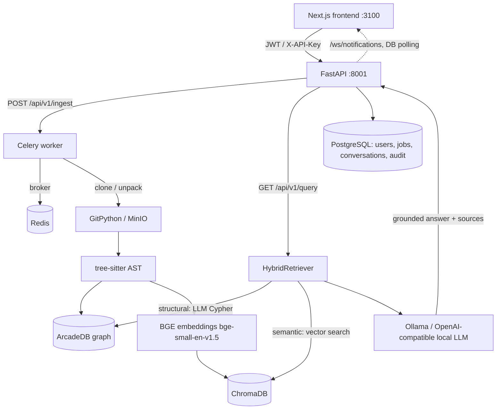

# Architecture

System overview of the Codebase Intelligence Platform. Every claim below is grounded in
the code as of v1.0; file paths are relative to the repo root.

## Services (docker-compose.yml)

One command (`docker compose up`) brings up the whole stack:

| Service | Image / build | Host port | Purpose |
|---|---|---|---|
| `backend` | `./backend` (FastAPI + Uvicorn) | 8001 → 8000 | Main API. Runs `alembic upgrade head` on boot, then serves `main:app`. |
| `worker` | same image as `backend` | — | Celery worker (`celery -A celery_app worker`) for durable ingestion jobs. |
| `frontend` | `./frontend` (Next.js) | 3100 → 3000 | UI. `NEXT_PUBLIC_API_URL` is baked in at **build** time. |
| `db` | `postgres:16-alpine` | 5433 → 5432 | Users, jobs, repos, conversations, notifications, audit log. |
| `redis` | `redis:7-alpine` | 6380 → 6379 | Celery broker (`CELERY_BROKER_URL=redis://redis:6379/0`). |
| `arcadedb` | `arcadedata/arcadedb` | 2480, 2424 | Code knowledge graph (queried in Cypher over the REST API). |
| `chroma` | `ghcr.io/chroma-core/chroma` | 8003 → 8000 | Vector store for code-chunk embeddings. |
| `minio` | `minio/minio` | 9000, 9001 | S3-compatible object storage for uploaded repo archives. Falls back to local filesystem when `MINIO_ENDPOINT` is unset. |
| Ollama | **host process** (not in compose by default) | 11434 | Local LLM. Containers reach it via `host.docker.internal`; an in-compose `ollama` service is provided commented-out. |

`backend`/`worker` wait on healthchecks for `db`, `redis`, `minio`, `arcadedb` before starting.

## AI pipeline

repo → clone → AST → graph → chunks → embeddings → retrieval → LLM → grounded answer.

1. **Acquire.** `POST /api/v1/ingest` (git clone via GitPython, SSRF-guarded URL
   validation in `backend/api/validators.py`) or `POST /api/v1/ingest/upload`
   (archive → MinIO via `backend/storage/`). The job is dispatched to Celery
   (`backend/api/tasks.py`, `backend/celery_app.py`) and tracked in `backend/api/jobs.py`.
2. **Parse.** tree-sitter grammars extract functions/classes/imports per file
   (`backend/ast_parser/`).
3. **Graph.** Entities and relationships (imports, calls, containment) are written to
   ArcadeDB (`backend/graph_db/builder.py`, thin REST client in `backend/graph_db/client.py`
   — reads via `/api/v1/query`, writes via `/api/v1/command`, Cypher as the query language).
4. **Chunk + embed.** `backend/vector_db/chunker.py` turns entities into text chunks;
   `backend/vector_db/embedder.py` encodes them with sentence-transformers
   `BAAI/bge-small-en-v1.5` (L2-normalized, lazily loaded, ~130 MB first download);
   `backend/vector_db/store.py` upserts into the Chroma collection `codebase_embeddings`
   (cosine HNSW).
5. **Retrieve.** `backend/retrieval/engine.py` (`QueryEngine`) is the single entry point.
   `HybridRetriever` (`backend/retrieval/retriever.py`) routes each question:
   - *structural* questions → LLM-generated Cypher (`cypher_generator.py`) executed
     against ArcadeDB, with automatic fallback to semantic search on failure or
     empty results;
   - everything else → the semantic path, itself hybrid: a widened pool of vector
     candidates from Chroma is re-ranked with Okapi BM25 (`lexical.py`, pure Python,
     code-aware tokenization) and fused via reciprocal-rank fusion, so exact
     identifier matches surface even when embeddings rank them low.
6. **Answer.** `backend/retrieval/answer.py` prompts the local LLM with the retrieved
   context (plus optional conversation history) and returns an answer with cited source
   file paths (`extract_sources` in `engine.py`).

The LLM layer (`backend/llm/`) is provider-flexible but free/local only: a native Ollama
client and an OpenAI-compatible client (LM Studio, llama.cpp, vLLM), both configured via
`LLM_BASE_URL` / `LLM_MODEL` (default `qwen2.5-coder:7b`). Runtime switching lives behind
`/api/v1/llm-config` (`backend/api/routes_llm.py`).

On top of the graph sit the analyzers: risk detection (`backend/risk_detection/`),
SAST/security scanning (`backend/security_scan/`), refactoring recommendations
(`backend/refactoring/`), change-impact/blast-radius (`backend/impact/`), and hotspots
(`backend/api/routes_hotspots.py`).

## Request / data flow

## Auth layers

All wired in `backend/main.py`:

- **FastAPI-Users JWT** (`backend/auth/users.py`): registration at `/auth/register`,
  login at `/auth/jwt/login`, user management under `/users`. JWTs are signed with
  `AUTH_SECRET`; a startup warning fires if the insecure dev default is still set.
- **GitHub OAuth** (`backend/auth/oauth_github.py`): `GET /auth/github/login` redirects to
  GitHub with a signed short-lived state JWT; `GET /auth/github/callback` exchanges the
  code, resolves a verified email, finds-or-creates the local `User`
  (`oauth_provider`/`oauth_subject`), and redirects to the SPA with a FastAPI-Users JWT
  in the URL **fragment** (`/login#token=...` — fragments never hit server logs). Enabled
  only when `GITHUB_CLIENT_ID`/`GITHUB_CLIENT_SECRET` are set; `GET /auth/providers`
  tells the UI whether to show the button.
- **Principal resolution** (`backend/api/security.py`): every data route under `/api/v1`
  takes `Depends(get_principal)`, which accepts, in priority order: (1) a valid JWT,
  (2) the static service `API_KEY` in `X-API-Key`, (3) a per-user API key in `X-API-Key`
  (`backend/auth/apikeys.py`, managed via `/api/v1/keys`). If `API_KEY` is unset, auth on
  data routes is disabled (dev mode) and a startup warning is logged.
- **RBAC** (`backend/auth/rbac.py`): per-repo roles `viewer < member < owner` in the
  `repo_members` table; `require_repo_role(min_role)` is a dependency factory that 403s
  when the caller's role is insufficient. Superusers bypass membership checks. Managed
  via `/api/v1/repos/{repo_id}/members`.
- **Rate limiting** (`backend/api/ratelimit.py`): slowapi per-client limits on ingest
  (`RATE_LIMIT_INGEST`, default 10/minute) and query (`RATE_LIMIT_QUERY`, default
  60/minute), with a no-op fallback if slowapi is missing.

## Background jobs and notifications

- **Celery + Redis** (`backend/celery_app.py`): ingestion runs on the worker container;
  `CELERY_TASK_ALWAYS_EAGER=true` runs tasks in-process for single-node dev/tests.
  Job status is polled via `GET /api/v1/ingest/{job_id}`.
- **WebSockets** (`backend/main.py`, `/ws/notifications`): authenticates via a
  `?token=<JWT>` query parameter (browsers cannot set an Authorization header on a
  WebSocket), then streams the user's notifications. Delivery is DB polling
  (`WS_POLL_INTERVAL`, default 2 s) against the shared database — no external pub/sub —
  so it works across the API and worker processes.
- **Observability** (`backend/observability.py`): structured logging with an
  `X-Request-ID` correlation header on every request, Prometheus metrics at `/metrics`
  (query latency, ingestion duration, LLM calls), liveness at `/health`, and per-service
  health at `/api/v1/health/services` (both deliberately unauthenticated).
